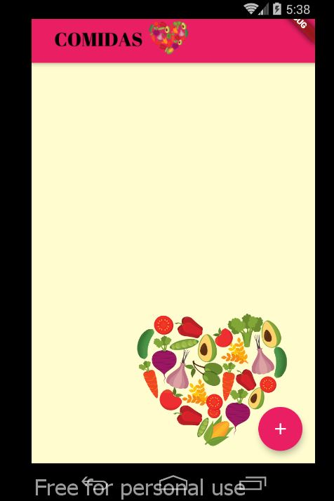
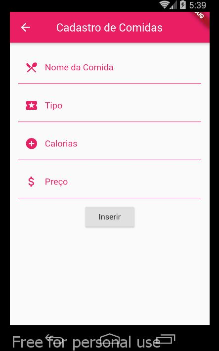
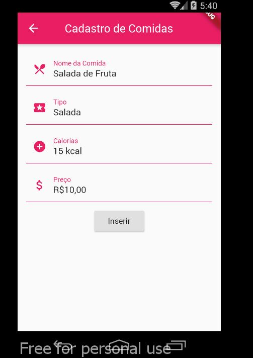
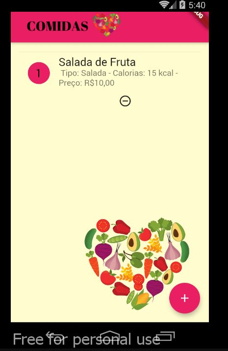
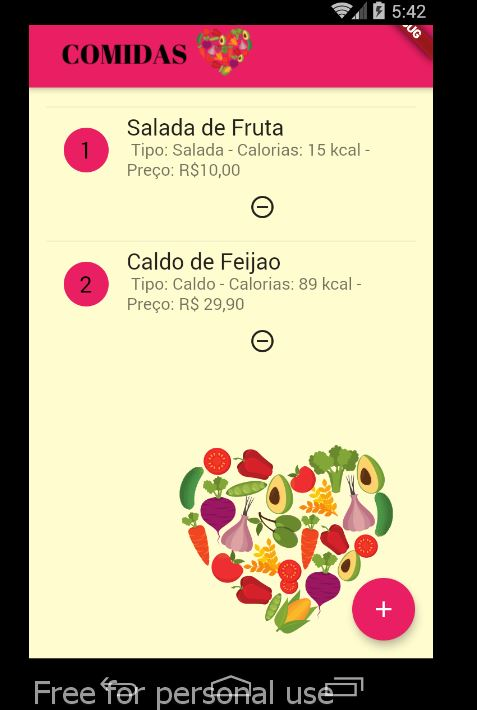

# CrudComidas

Aplicação com Flutter capaz de consultar, inserir, alterar e excluir dados em
um banco de dados SQLite. Aplicado para a prova de Desenvolvimento de Software para dispositivos móveis II.

# Preview

